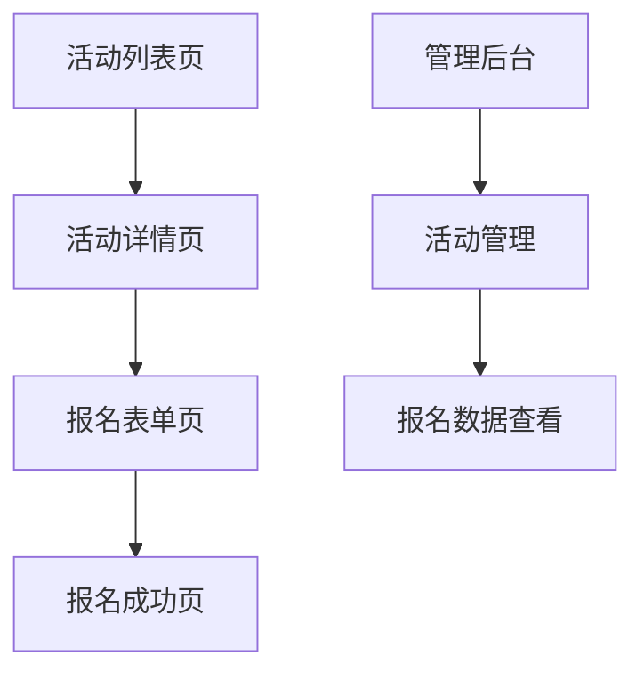

## 1. 产品概述
活动报名模块用于收集和管理用户对各类活动的报名信息。管理员可以创建活动并查看报名数据，用户可以轻松浏览活动并完成报名流程。

目标用户包括活动组织者和参与者，为双方提供便捷的报名管理解决方案。

## 2. 核心功能

### 2.1 用户角色
| 角色 | 注册方式 | 核心权限 |
|------|----------|----------|
| 普通用户 | 邮箱注册 | 浏览活动、提交报名、查看报名状态 |
| 管理员 | 后台创建 | 创建活动、管理报名信息、导出数据 |

### 2.2 功能模块
活动报名模块包含以下核心页面：
1. **活动列表页**：展示所有可报名活动，包含搜索和筛选功能
2. **活动详情页**：显示活动详细信息，提供报名入口
3. **报名表单页**：收集用户报名信息，支持表单验证
4. **报名成功页**：确认报名成功，显示相关提示信息
5. **管理后台**：活动管理和报名数据查看

### 2.3 页面详情
| 页面名称 | 模块名称 | 功能描述 |
|----------|----------|----------|
| 活动列表页 | 活动展示 | 展示活动标题、时间、地点、剩余名额等基本信息 |
| 活动列表页 | 搜索筛选 | 支持按关键词搜索、时间筛选、分类筛选 |
| 活动详情页 | 活动信息 | 显示活动详细介绍、时间地点、费用、注意事项 |
| 活动详情页 | 报名按钮 | 提供明显的报名入口，显示剩余名额 |
| 报名表单页 | 基本信息 | 收集姓名、手机号、邮箱等必填信息 |
| 报名表单页 | 扩展信息 | 根据活动需求收集公司、职位、备注等选填信息 |
| 报名表单页 | 表单验证 | 实时验证输入格式，防止错误提交 |
| 报名成功页 | 成功提示 | 显示报名成功信息和后续操作指引 |
| 管理后台 | 活动管理 | 创建、编辑、删除活动，设置报名截止时间 |
| 管理后台 | 报名管理 | 查看报名列表，支持导出Excel功能 |

## 3. 核心流程

### 用户报名流程
用户访问活动列表 → 选择感兴趣的活动 → 查看活动详情 → 点击报名 → 填写报名表单 → 提交报名 → 查看报名成功页面

### 管理员操作流程
管理员登录 → 创建新活动 → 设置活动信息 → 发布活动 → 查看报名数据 → 导出报名列表

## 4. 用户界面设计

### 4.1 设计风格
- **主色调**：蓝色系（#1890ff）体现专业感，辅以绿色（#52c41a）表示成功状态
- **按钮样式**：圆角矩形，主要操作为实心按钮，次要操作为边框按钮
- **字体选择**：系统默认字体，标题16-18px，正文14px，辅助文字12px
- **布局风格**：卡片式布局，清晰的信息层级，充足的留白
- **图标风格**：使用简洁的线性图标，保持视觉一致性

### 4.2 页面设计概述
| 页面名称 | 模块名称 | UI元素 |
|----------|----------|--------|
| 活动列表页 | 活动卡片 | 卡片阴影效果，包含活动图片、标题、时间、地点标签 |
| 活动列表页 | 筛选栏 | 顶部横向布局，包含搜索框和筛选下拉菜单 |
| 活动详情页 | 头部横幅 | 全宽活动主图，覆盖渐变遮罩层 |
| 活动详情页 | 信息区块 | 分模块展示，使用图标+文字的组合方式 |
| 报名表单页 | 表单区域 | 垂直排列的输入框，带标签和占位符提示 |
| 报名表单页 | 提交按钮 | 固定在页面底部，全宽蓝色按钮 |
| 报名成功页 | 成功图标 | 大号绿色勾选图标，居中显示 |
| 管理后台 | 数据表格 | 简洁的数据表格，支持排序和分页 |

### 4.3 响应式设计
采用桌面端优先的设计策略，确保在PC端有最佳体验。移动端通过媒体查询适配，主要调整：
- 列表布局从多列变为单列
- 表单输入框宽度自适应
- 按钮尺寸增大便于触摸操作
- 导航菜单折叠为汉堡菜单

## 5. 数据需求

### 5.1 活动信息
- 基本信息：标题、描述、时间、地点、费用、名额限制
- 状态信息：报名开始/截止时间、活动状态（未开始/进行中/已结束）
- 扩展信息：活动分类、标签、封面图片

### 5.2 报名信息
- 用户基础：姓名、手机号、邮箱
- 扩展信息：公司、职位、年龄、性别（可配置）
- 报名状态：已提交/已确认/已取消
- 时间信息：报名时间、更新时间