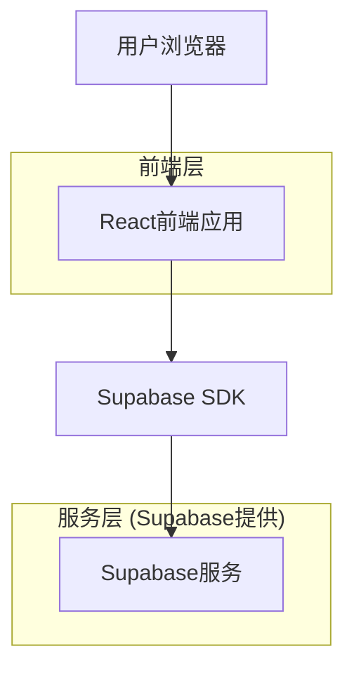
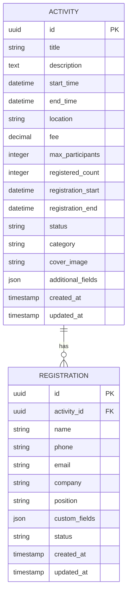

## 1. 架构设计



## 2. 技术栈描述

- **前端**: React@18 + tailwindcss@3 + vite
- **初始化工具**: vite-init
- **后端**: Supabase (无独立后端服务)
- **数据库**: Supabase PostgreSQL
- **身份验证**: Supabase Auth
- **文件存储**: Supabase Storage (活动图片)

## 3. 路由定义

| 路由 | 用途 |
|------|------|
| / | 活动列表页，展示所有可报名活动 |
| /activity/:id | 活动详情页，显示具体活动信息 |
| /register/:id | 报名表单页，收集用户信息 |
| /success | 报名成功页，显示确认信息 |
| /admin | 管理后台首页 |
| /admin/activities | 活动管理页面 |
| /admin/registrations | 报名数据管理页面 |
| /login | 管理员登录页面 |

## 4. 数据模型

### 4.1 数据模型定义



### 4.2 数据定义语言

活动表 (activities)
```sql
-- 创建活动表
CREATE TABLE activities (
    id UUID PRIMARY KEY DEFAULT gen_random_uuid(),
    title VARCHAR(255) NOT NULL,
    description TEXT,
    start_time TIMESTAMP WITH TIME ZONE NOT NULL,
    end_time TIMESTAMP WITH TIME ZONE NOT NULL,
    location VARCHAR(255) NOT NULL,
    fee DECIMAL(10,2) DEFAULT 0,
    max_participants INTEGER DEFAULT 0,
    registered_count INTEGER DEFAULT 0,
    registration_start TIMESTAMP WITH TIME ZONE NOT NULL,
    registration_end TIMESTAMP WITH TIME ZONE NOT NULL,
    status VARCHAR(20) DEFAULT 'draft' CHECK (status IN ('draft', 'published', 'cancelled', 'completed')),
    category VARCHAR(50),
    cover_image VARCHAR(500),
    additional_fields JSONB DEFAULT '{}',
    created_at TIMESTAMP WITH TIME ZONE DEFAULT NOW(),
    updated_at TIMESTAMP WITH TIME ZONE DEFAULT NOW()
);

-- 创建索引
CREATE INDEX idx_activities_status ON activities(status);
CREATE INDEX idx_activities_registration_end ON activities(registration_end);
CREATE INDEX idx_activities_category ON activities(category);
```

报名表 (registrations)
```sql
-- 创建报名表
CREATE TABLE registrations (
    id UUID PRIMARY KEY DEFAULT gen_random_uuid(),
    activity_id UUID REFERENCES activities(id) ON DELETE CASCADE,
    name VARCHAR(100) NOT NULL,
    phone VARCHAR(20) NOT NULL,
    email VARCHAR(255) NOT NULL,
    company VARCHAR(255),
    position VARCHAR(100),
    custom_fields JSONB DEFAULT '{}',
    status VARCHAR(20) DEFAULT 'submitted' CHECK (status IN ('submitted', 'confirmed', 'cancelled')),
    created_at TIMESTAMP WITH TIME ZONE DEFAULT NOW(),
    updated_at TIMESTAMP WITH TIME ZONE DEFAULT NOW()
);

-- 创建索引
CREATE INDEX idx_registrations_activity_id ON registrations(activity_id);
CREATE INDEX idx_registrations_email ON registrations(email);
CREATE INDEX idx_registrations_status ON registrations(status);
```

### 4.3 访问权限设置

```sql
-- 活动表权限
GRANT SELECT ON activities TO anon;
GRANT ALL PRIVILEGES ON activities TO authenticated;

-- 报名表权限
GRANT SELECT ON registrations TO anon;
GRANT ALL PRIVILEGES ON registrations TO authenticated;

-- 创建行级安全策略
ALTER TABLE activities ENABLE ROW LEVEL SECURITY;
ALTER TABLE registrations ENABLE ROW LEVEL SECURITY;

-- 活动读取策略（所有人可读）
CREATE POLICY "Activities are viewable by everyone" ON activities
    FOR SELECT USING (true);

-- 活动管理策略（仅管理员可写）
CREATE POLICY "Activities are manageable by admins" ON activities
    FOR ALL USING (auth.jwt() ->> 'role' = 'admin');

-- 报名创建策略（登录用户可创建）
CREATE POLICY "Users can create registrations" ON registrations
    FOR INSERT WITH CHECK (auth.uid() IS NOT NULL);

-- 报名查看策略（用户可查看自己的报名）
CREATE POLICY "Users can view own registrations" ON registrations
    FOR SELECT USING (auth.uid() = user_id);
```

## 5. 核心功能实现

### 5.1 前端状态管理
使用React Context + useReducer管理全局状态：
- 活动列表状态
- 用户登录状态
- 报名状态

### 5.2 表单验证
- 前端：React Hook Form + Yup schema验证
- 后端：Supabase数据库约束
- 实时验证：手机号格式、邮箱格式

### 5.3 文件上传
使用Supabase Storage存储活动封面图片：
```javascript
const { data, error } = await supabase.storage
  .from('activity-images')
  .upload(`public/${activityId}.jpg`, file);
```

### 5.4 实时数据更新
利用Supabase Realtime功能，实现报名数据的实时更新：
```javascript
const subscription = supabase
  .from('registrations')
  .on('INSERT', payload => {
    console.log('New registration:', payload);
  })
  .subscribe();
```

## 6. 部署配置

### 6.1 环境变量
```bash
VITE_SUPABASE_URL=your_supabase_url
VITE_SUPABASE_ANON_KEY=your_supabase_anon_key
```

### 6.2 构建配置
使用Vite构建，配置如下：
```javascript
// vite.config.js
export default {
  build: {
    outDir: 'dist',
    sourcemap: true
  },
  server: {
    port: 3000
  }
}
```