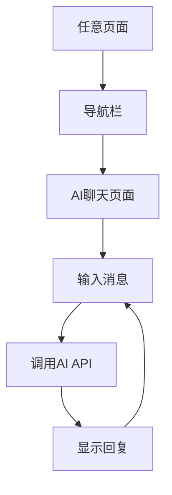

## 1. 产品概述
新增AI聊天页面，为用户提供智能对话体验。通过接入astroncodingplan提供的AI模型，用户可以在网站内直接与AI助手进行实时对话，获取编程相关的帮助和建议。

## 2. 核心功能

### 2.1 用户角色
无需用户注册，所有访问者均可使用AI聊天功能。

### 2.2 功能模块
AI聊天页面包含以下核心模块：
1. **AI聊天页面**: 聊天窗口、消息输入、历史记录、模型配置。

### 2.3 页面详情
| 页面名称 | 模块名称 | 功能描述 |
|---------|---------|---------|
| AI聊天页面 | 聊天窗口 | 显示用户与AI的对话消息，支持markdown格式渲染 |
| AI聊天页面 | 消息输入 | 提供文本输入框，支持多行输入和发送按钮 |
| AI聊天页面 | 历史记录 | 保存当前会话的聊天记录，支持清空功能 |
| AI聊天页面 | 模型配置 | 显示当前使用的AI模型信息(astron-code-latest) |

## 3. 核心流程
用户通过导航栏点击"AI聊天"进入聊天页面，在输入框中输入问题并发送，系统调用astroncodingplan API获取AI回复并显示在聊天窗口中。

## 4. 用户界面设计

### 4.1 设计风格
- 主色调：深蓝色(#1e40af)和白色
- 按钮样式：圆角矩形，悬停效果
- 字体：系统默认字体，消息字体14-16px
- 布局：左右分栏，左侧聊天窗口，右侧模型信息
- 图标：使用简洁的聊天气泡图标

### 4.2 页面设计概览
| 页面名称 | 模块名称 | UI元素 |
|---------|---------|---------|
| AI聊天页面 | 聊天窗口 | 高度400px，宽度100%，背景白色，边框圆角，消息气泡区分用户和AI |
| AI聊天页面 | 消息输入 | 底部固定输入框，高度80px，包含发送按钮 |
| AI聊天页面 | 历史记录 | 顶部工具栏，包含清空按钮 |
| AI聊天页面 | 模型信息 | 右侧边栏显示模型名称和配置信息 |

### 4.3 响应式设计
采用桌面优先设计，在移动设备上自适应为单栏布局，聊天窗口全屏显示。

### 4.4 集成要求
- 在网站导航栏添加"AI聊天"链接
- URL路径为: https://awesome-astron-workflow.dev/chat
- 与现有网站风格保持一致